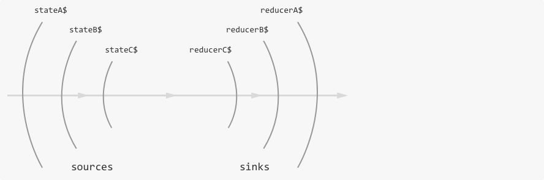

# Cycle.js onionify

Augments your [Cycle.js](https://cycle.js.org) main function with onion-shaped state management and a single state atom.

- **Simple:** all state lives in one place only
- **Predictable:** use the same pattern to build any component
- **Reusable:** you can move any component to any other codebase using onionify
- **Tiny:** library has less than 100 lines of code, less than 2 kB

Quick example:

```
npm install cycle-onionify
```

```js
import onionify from 'cycle-onionify';
// ...

function main(sources) {
  const state$ = sources.onion.state$;
  const vdom$ = state$.map(state => /* render virtual DOM here */);

  const initialReducer$ = xs.of(function initialReducer() { return 0; });
  const addOneReducer$ = xs.periodic(1000)
    .mapTo(function addOneReducer(prev) { return prev + 1; });
  const reducer$ = xs.merge(initialReducer$, addOneReducer$);

  return {
    DOM: vdom$,
    onion: reducer$,
  };
}

const wrappedMain = onionify(main);

Cycle.run(wrappedMain, {
  DOM: makeDOMDriver('#app'),
});
```

# What is onionify

**A fractal state management tool for Cycle.js applications.** `onionify` creates a wrapped `main` function, where the wrapped result will have a top-level state stream, and will pass that down to the actual `main` function. Onionify is a component wrapper, not a driver. This way, your application state won't live in a driver, because the wrapped `main` is still just a Cycle.js app that can be given to `Cycle.run`.

**State stream as source, reducer stream as sink.** Your `main` function can expect a `StateSource` object under `sources.onion`, and is supposed to return a stream of reducer functions under `sinks.onion`.

**One large state tree for your entire application.** All the state in your application should live in the state stream managed internally by onionify. Smaller components in your application can access and update pieces of state by interfacing with its parent component with the help of `@cycle/isolate`. The parent gives an isolated onion source to its child, and receives an isolated onion sink from its child. The parent component interfaces with the grandparent component in the same style. This makes state management [*fractal*](http://staltz.com/unidirectional-user-interface-architectures.html).



```js
stateA$ // Emits `{visitors: {count: 300}}}`
stateB$ // Emits `{count: 300}`
stateC$ // Emits `300`

reducerC$ // Emits `function reducerC(count) { return count + 1; }`
reducerB$ // Emits `function reducerB(visitors) { return reducerC(visitors); }`
reducerA$ // Emits `function reducerA(appState) { return reducerB(appState); }`
```

**"Fractal"** means that every component in the hierarchy is built in the same way as the top-level `main` function is built. As a consequence, there is no absolute "global" state, since every component treats its state management *relative* to its parent. The top-most component will have onionify as its parent.

As a consequence, state management is layered like an onion. State streams (sources) will be "peeled off" one layer each time they cross a component input boundary. Reducer streams (sinks) will be stacked one layer each time they cross a component output boundary.

# Why use onionify

**Simpler parent-child state coordination.** Traditional Cycle.js state management with `props$` and `state$` is hard to grok and easy to shoot yourself in the foot. With onion-layered state, there is no distinction between props and state because both are encoded in the large state tree. If the parent needs to send "props" to a child, it can just directly update the child's state.

**Eliminates most circular dependencies of streams.** Cycle.js and [xstream](http://staltz.com/xstream/) apps support building circularly dependent streams with `imitate()`, and this technique was often utilized for state management. It was easily a footgun. Because onionify internally uses a circular dependency of streams, it eliminates the need for applications to have any circular dependency related to state.

**Familiar technique: reducer functions and a single state atom.** Like [Redux](http://redux.js.org/) and the [Elm architecture](https://guide.elm-lang.org/architecture/index.html), onionify allows you to contain all of your application state in one large tree of objects and arrays. To update any part in that state tree, you write reducer functions: pure functions that take previous state as argument and return new state.

**Fractal, like most Cycle.js apps should be.** Unlike Redux, there is no *global entity* in the onion state architecture, except for the usage of the `onionify` function itself, which is one line of code. The onion state architecture is similar to the Elm architecture in this regard, where any component is written in the same way without expecting any global entity to exist. As a result, you gain reusability: you can take any component and run it anywhere else because it's not tied to any global entity. You can reuse the component in another Cycle.js onionified app, or you can run the component in isolation for testing purposes without having to mock any external dependency for state management (such as a Flux Dispatcher).

**Does not require IDs to manage a list of components.** In Redux, Elm arch, traditional Cycle.js, and [Stanga](https://github.com/milankinen/stanga), to manage a collection of components (such as a dynamic to-do list), you need to issue unique IDs and manage them when reducers need to update a particular entry. In [Redux TodoMVC](https://github.com/reactjs/redux/blob/055f0058931465af6f96213a99461fc852f83c61/examples/todomvc/src/reducers/todos.js#L16), this is `id: state.reduce((maxId, todo) => Math.max(todo.id, maxId), -1) + 1,` and in [Elm TodoMVC](https://github.com/evancz/elm-todomvc/blob/11fc6bef5f53ebd062caf9b6ce7b95e84634e9a5/Todo.elm#L129), this is `{ model | uid = model.uid + 1}`. In onionify, to manage arrays in the state tree you do not need ID numbers at all. For instance, a to-do entry component can delete itself from the list using a reducer that returns undefined as the new state. See the source code for [TodoMVC Cycle.js onionified](https://github.com/cyclejs/todomvc-cycle/tree/onionify/src).

# How to use onionify

### How to set up

```
npm install --save cycle-onionify
```

[xstream](http://staltz.com/xstream/) v10 is a hard dependency. If you use npm v3 (you should), this should not create multiple instances of xstream in `node_modules`, since most Cycle.js packages are using xstream v10 too.

Import and call onionify on your `main` function (the top-most component in your app):

```js
import onionify from 'cycle-onionify';

function main(sources) {
  // ...
  return sinks;
}

const wrappedMain = onionify(main);

Cycle.run(wrappedMain, drivers);
```

### How to read state and update state

If you have onionified your `main` function, it can now expect to have `sources.onion`. This is not a simple stream, it is a "StateSource" object, which is necessary to support isolation. The most important thing to know about this object is that it has the `state$` property. Then, your `main` function can return a stream of reducer functions under `sinks.onion`:

```js
function main(sources) {
  // Stream of the state object changing over time
  const state$ = sources.onion.state$;

  // Use state$ somehow, for instance, to create vdom$ for the DOM.

  // Stream of reducer. Each emission is a function that describes how
  // state should change.
  const reducer$ = xs.periodic(1000)
    .mapTo(function reducer(prevState) {
      // return new state
    });

  const sinks = {
    onion: reducer$, // send these reducers back up
  }

  return sinks;
}
```

### How to initialize state

State is initialized also with a reducer. This is different to Redux and Elm where the initial state is a separate entity. With onionify, just create an `initReducer$` and send that to `sinks.onion`.

```js
const initReducer$ = xs.of(function initReducer(prevState) {
  // Note that we ignore the prevState argument given,
  // since it's probably undefined anyway
  return {count: 0}; // this is the initial state
});

const reducer$ = xs.merge(initReducer$, someOtherReducer$);

const sinks = {
  onion: reducer$,
};
```

### How to compose nested components

To use a child component in another component, where both use onionified state, you should use the `isolate()` helper function from `@cycle/isolate`. Suppose the shape of state in the parent component is:

```typescript
{
  foo: string,
  bar: number,
  child: {
    count: number,
  },
}
```

The property `child` will host the state for the child component. The parent component needs to isolate the child component under the **scope** `'child'`, then the StateSource and `isolate` will know to pick that property from the parent state object when providing `sources.onion` to the child. Then, for any reducer emitted by the child's onion sink, `isolate` will wrap that child reducer in a parent reducer that works on the `child` property.

```js
function Parent(sources) {
  const state$ = sources.onion.state$; // emits { foo, bar, child }
  const childSinks = isolate(Child, 'child')(sources);

  // ...

  // All these reducers operate on { foo, bar, child } state objects
  const parentReducer$ = xs.merge(initReducer$, someOtherReducer$);
  const childReducer$ = childSinks.onion; // even this one
  const reducer$ = xs.merge(parentReducer$, childReducer$);

  return {
    onion: reducer$,
    // ...
  }
}
```

Where the child component is:

```js
function Child(sources) {
  const state$ = sources.onion.state$; // emits { count }

  // ...

  // These reducers operate on { count } state objects
  const reducer$ = xs.merge(initReducer$, someOtherReducer$);

  return {
    onion: reducer$,
    // ...
  }
}
```

When state source crosses the isolation boundary from parent into child, we "peel off" the state object using the isolation *scope*. Then, when crossing the isolation boundary from child back to the parent, we "wrap" the reducer function using the isolation *scope*. This layered structure justifies the "onion" name.

### How to provide default state for a nested component

Sometimes the state for the child is given from the parent (what is usually described as "props"), but other times the parent does not pass any state for the child, and the child must initialize its own state.

To accomplish that, we can modify the `initReducer$` of the child component, and turn it into a `defaultReducer$`:

```js
const defaultReducer$ = xs.of(function defaultReducer(prevState) {
  if (typeof prevState === 'undefined') {
    return {count: 0}; // Parent didn't provide state for the child, so initialize it.
  } else {
    return prevState; // Let's just use the state given from the parent.
  }
});
```

It is a good idea to use a `defaultReducer$` instead of an `initialReducer$`, as a rule of thumb.

### How to handle a dynamic list of nested components

The state object tree can have nested state objects, but it can also have nested state arrays. This becomes useful when you are building a list of child components.

Suppose your parent component's state is an array:

```js
function Parent(sources) {
  const array$ = sources.onion.state$; // emits [{ count: 0 }, { count: 1 }, ... ]

  // ...

  // This reducer will concat an object every second
  const reducer$ = xs.periodic(1000).map(i => function reducer(prevArray) {
    return prevArray.concat({count: i})
  });

  return {
    onion: reducer$,
    // ...
  }
}
```

Each object `{ count: i }` in the array can become the state object for a child component. We need to call the `Child` component with isolate, and passing a unique isolation *scope* for each. To do that, we can just use the indices of the array items.

```js
function Parent(sources) {
  const array$ = sources.onion.state$;

  const childrenSinks$ = array$.map(array =>
    array.map((item, index) => isolate(Child, index)(sources))
  );

  // ...
}
```

As you see, instead of a `childSinks`, we get a `childrenSinks$`, which is a stream that emits **arrays with sinks**. Each item in that array is a sinks object for each child instance. Item 0 is the sinks object for the first child, item 1 is the sinks object for the second child, and so forth. And as a reminder, each sinks object has multiple streams. So it's a *stream of arrays of objects with streams*.

This may seem like a complex structure, but all you need to know is that `childrenSinks$` contains all sinks for all children components. Onionify provides helpers to easily handle them: custom xstream operators `pick` and `mix`.

```js
import {pick, mix} from 'cycle-onionify';
```

Suppose you want to get all reducers from all children and merge them together. First you "pick" the `onion` sink from each child sink (this is similar to lodash [get](https://lodash.com/docs/4.16.4#get) or [pick](https://lodash.com/docs/4.16.4#get)), then the outcome will be a stream of arrays, where array items are reducer streams. Second, you merge all those onion sinks together with `mix(xs.merge)`, to get a simple stream of reducers.

```js
const childrenSinks$ = array$.map(array =>
  array.map((item, index) => isolate(Child, index)(sources))
);

const childrenReducers$ = childrenSinks$
  .compose(pick(sinks => sinks.onion)); // or...
//.compose(pick('onion'));
// it does the same thing

const childrenReducer$ = childrenReducers$
  .compose(mix(xs.merge));
```

Then, you can merge the children reducers with the parent reducers (if there are any), and return those from the parent:

```js
function Parent(sources) {
  const array$ = sources.onion.state$;

  const childrenSinks$ = array$.map(array =>
    array.map((item, index) => isolate(Child, index)(sources))
  );

  const childrenReducers$ = childrenSinks$.compose(pick('onion'));
  const childrenReducer$ = childrenReducers$.compose(mix(xs.merge));

  // ...

  const reducer$ = xs.merge(childrenReducer$, parentReducer$);

  return {
    onion: reducer$,
    // ...
  }
}
```

This same pattern above should be used in most cases where you need to pick the onion sink from each child and merge them. However, `mix()` allows you to use not only `merge`, but also `combine`. This is useful when combining all children DOM sinks together as one array:

```js
const vdom$ = childrenSinks$
  .compose(pick('DOM'))
  .compose(mix(xs.combine))
  .map(itemVNodes => ul(itemVNodes));
```

Depending on the type of sink, you may want to use the `merge` strategy or the `combine` strategy. Usually `merge` is used for reducers and `combine` for Virtual DOM streams. In the more general case, `merge` is for events and `combine` is for values-over-time (["signals"](https://github.com/cyclejs/cyclejs/wiki/Understanding-Signals-vs-Events)).

**To add a new child instance**, the parent component just needs to concatenate the state array, like we did with this reducer in the parent:

```js
const reducer$ = xs.periodic(1000).map(i => function reducer(prevArray) {
  return prevArray.concat({count: i})
});
```

**To delete a child instance**, the child component to be deleted can send a reducer which returns undefined. This will tell the onionify internals to remove that piece of state from the array, and ultimately delete the child instance and its sinks too.

```js
function Child(sources) {
  // ...

  const deleteReducer$ = deleteAction$.mapTo(function deleteReducer(prevState) {
    return undefined;
  });

  const reducer$ = xs.merge(deleteReducer$, someOtherReducer$);

  return {
    onion: reducer$,
    // ...
  };
}
```

See the example code at `examples/advanced` for more details.

### How to share data among components, or compute derived data

There are cases when you need more control over the way the state is passed from parent to child components. The standard mechanism of "peeling off" the state object is not flexible enough in situations such as:

- a component needs access to the same state object as its parent
- a component needs a combination of several pieces of the state object
- you need to manipulate a piece of data before passing it to a component

In such cases you can use *lenses*. The idea of lenses is simple: they provide a view over a data structure, so that the user can see and modify the data through it.

The standard mechanism is already implementing a simple form of lens:

```js
const fooSinks = isolate(Foo, 'foo')(sources);
```
By isolating the component with `'foo'` we are *focusing* on that specific piece of the state object. The same thing can be achieved more explicitly as follows:

```js
const fooLens = {
  get: state => state.foo,
  set: (state, childState) => ({...state, foo: childState})
};

const fooSinks = isolate(Foo, {onion: fooLens})(sources);
```

The `fooLens` is composed of a `get` function that extracts the `.foo` sub-state, and a `set` function that returns the updated state whenever the sub-state is modified by the child component. Lenses can be used as scopes in `isolate` thanks to [flexible isolation](https://cycle.js.org/releases.html#flexible-isolation).

A common use case for lenses is sharing data among components. The following lenses give components read/write access to the same `status` value:

```js
// state in the parent: { foo: 3, bar: 8, status: 'ready' }

const fooLens = { //    { val: 3, status: 'ready' }
  get: state => ({val: state.foo, status: state.status}),
  set: (state, childState) => ({...state, foo: childState.val, status: childState.status})
};

const barLens = { //    { val: 8, status: 'ready' }
  get: state => ({val: state.bar, status: state.status}),
  set: (state, childState) => ({...state, bar: childState.val, status: childState.status})
};

const fooSinks = isolate(Child, {onion: fooLens})(sources);
const barSinks = isolate(Child, {onion: barLens})(sources);
```

Another use case is computing derived data, for example the average of an array of numbers:

```js
// state in the parent: { xs: [23, 12, 25] }

const averageLens = {// { avg: 20 }
  get: state => ({avg: state.xs.reduce((a, b) => a + b, 0) / state.xs.length}),
  set: (state, childState) => state // ignore updates
}
```

### How to choose a different key other than `onion`

If you want to choose what key to use in sources and sinks (the default is `onion`), pass it as the second argument to onionify:

```js
function main(sources) {
  // sources.stuff is the StateSource

  return {
    stuff: reducer$, // stream of reducer functions
  };
}

const wrappedMain = onionify(main, 'stuff');

Cycle.run(wrappedMain, drivers);
```

### How to use it with TypeScript

We recommend that you export these types for every component: `Action`, `State`, `Reducer`, `Source`, `Sinks`. Below is an example of what these types usually look like:

```typescript
export interface BleshAction {
  type: 'BLESH';
  payload: number;
};

export interface BloshAction {
  type: 'BLOSH';
  payload: string;
};

export type Action = BleshAction | BloshAction;

export interface State {
  count: number;
  age: number;
  title: string;
}

export type Reducer = (prev?: State) => State | undefined;

export interface Sources {
  DOM: DOMSource;
  onion: StateSource<State>;
}

export interface Sinks {
  DOM: Stream<VNode>;
  onion: Stream<Reducer>;
}

function MyComponent(sources: Sources): Sinks {
  // ...
}
```

The `StateSource` type comes from onionify and you can import it as such:

```typescript
import {StateSource} from 'cycle-onionify';
```

Then, you can compose nested state types:

```typescript
import {State as ChildState} from './Child';

export interface State {
  list: Array<ChildState>;
}
```

See some example code at `examples/advanced` for more details.

# FAQ

### Are there any caveats?

There are some caveats. Removing the distinction state vs props means that these two concepts are conflated, and both parent and child have direct access to modify the state for the child. This may lead to cases where you read the source code for the child component, but cannot be sure how does that state behave over time, since the parent may be modifying it dynamically and concurrently. Even though we use immutability, this is a type of shared-memory concurrency. It also loses some reactive programming properties, since according to reactive programming, the entire behavior of `state$` should be declared in one line of code.

The state vs props distinction makes the parent-child boundary explicit, making it possible for the child component to regulate which props from the parent does it allow or reject. With onionify, the child cannot protect its state from being tampered by the parent in possibly undesireable ways.

That said, state vs props management is too hard to master with Cycle.js (and also in vanilla React). Most of the times state vs props explicit distinction is unnecessary. This caveat in Onionify also happens with Elm nested update functions and [Om](https://github.com/omcljs/om) through cursors. In practice, the developer should just be careful to avoid invasive child state updates from the parent. Try to contain all child state updates in the child component, while occasionally allowing the parent to update it too.

### Does it support [RxJS](http://reactivex.io/rxjs/) or [most.js](https://github.com/cujojs/most)?

No, not yet. It only supports xstream. However, for the time being, you could try to implement onionify on your own, since it's just less than 100 lines of code. In the long run, we want to build [Cycle Unified](https://github.com/cyclejs/cyclejs/issues/425) which could allow running this tool with RxJS or most.js.

### Does it support [Immutable.js](https://facebook.github.io/immutable-js/)?

No, not yet. It only supports JavaScript objects and arrays. However, supporting Immutable.js is very important to us and we want to do it, either directly supporting it in this library, or building another onionify library just for Immutable.js. Let's see.

### How does this fit with Model-View-Intent (MVI)?

Very well. Model would hold the definitions for the reducer streams, and return that as one `reducer$` stream. Model would not return `state$`, as it would traditionally. Overall, onionify works well with the MVI pattern:

- Intent: maps DOM source to an action stream.
- Model: maps action streams to a reducer stream.
- View: maps state stream to virtual DOM stream.

Example:

```js
function main(sources) {
  const state$ = sources.onion.state$;
  const action$ = intent(sources.DOM);
  const reducer$ = model(action$);
  const vdom$ = view(state$);

  const sinks = {
    DOM: vdom$,
    onion: reducer$,
  };
  return sinks;
}
```

### How does this work?

Read the source. It's less than 100 lines of code, and probably quicker to read the source than to explain it in words.

### Why is this not official in Cycle.js?

If all goes well, eventually this will be an official Cycle.js practice. For now, we want to experiment in the open, collect feedback, and make sure that this is a solid pattern. There are [other approaches](https://github.com/cyclejs/cyclejs/issues/312) to state management in Cycle.js and we want to make sure the most popular one ends up being the official one.

### How does this compare to [Stanga](https://github.com/milankinen/stanga)?

- Stanga is a "driver". Onionify is a component wrapper function.
- Stanga defines initial state as a separate argument. Onionify defines initial state as a reducer.
- Stanga uses helper functions and lenses for sub-states. Onionify leverages `@cycle/isolate`.
- Stanga uses unique IDs for managing dynamic lists. Onionify does not.

### How does this compare to [Redux](http://redux.js.org/)?

- Redux is not fractal (and has a visible global entity, the Store). Onionify is fractal (and has an invisible global entity).
- Redux defines initial state in the argument for a reducer. Onionify defines initial state as a reducer itself.
- Redux reducers have two arguments `(previousState, action) => newState`. Onionify reducers have one argument `(previousState) => newState` (the action is given from the closure).
- Redux uses unique IDs for managing dynamic lists. Onionify does not.

### How does this compare to the [Elm architecture](https://guide.elm-lang.org/architecture/index.html)?

- Both are fractal.
- Elm reducers have two arguments `Msg -> Model -> ( Model, Cmd Msg )`. Onionify reducers have one argument `(previousState) => newState`.
- Elm child reducers are explicitly composed and nested in parent reducers. Onionify child reducers are isolated with `@cycle/isolate` and merged with parent reducers.
- Elm child actions are nested in parent actions. In onionify, actions in child components are unrelated to parent actions.
- Elm architecture uses unique IDs for managing dynamic lists. Onionify does not.

### How does this compare to ClojureScript [Om](https://github.com/omcljs/om)?

- Om [Cursors](https://github.com/omcljs/om/wiki/Cursors) are very similar in purpose to `onionify` + `isolate`.
- Om cursors are updated with imperative `transact!`. Onionify state is updated with declarative reducer functions.
- Om uses unique IDs for managing dynamic lists. Onionify does not.
